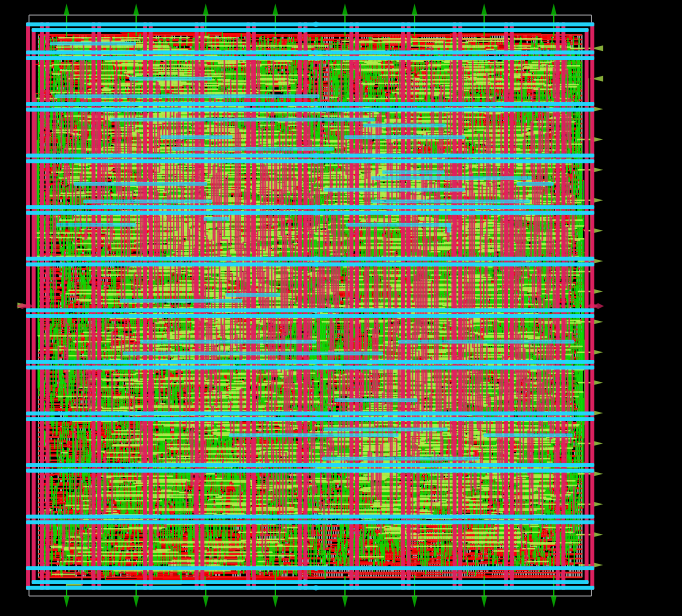

# RV32I RISC-V Processor — RTL to GDSII

This project contains a 32-bit RISC-V RV32I processor implemented in Verilog and taken through an ASIC RTL-to-GDSII physical design flow using the Sky130 standard-cell flow.

The repository includes the RTL source, verification testbench, physical-design configuration, and selected final implementation artifacts from the successful run.

## Final Layout



The image above shows the final routed physical layout of the RV32I processor.

## Project Structure

```text
.
├── README.md
├── layout.png
├── config.yaml
├── pin_order.cfg
├── src/
│   ├── ALU.v
│   ├── CONTROL_UNIT.v
│   ├── DATA_MEM.v
│   ├── INSTR_MEM.v
│   ├── PC.v
│   ├── REGISTER_FILE.v
│   ├── topmodule.v
│   ├── WRAPPER_MEM.v
│   ├── impl.sdc
│   ├── signoff.sdc
│   └── instr.mem
├── verify/
│   └── tb_topmodule.v
└── runs/
    └── RUN_2026-08-24_05-55-19/
        └── final/
            ├── gds/
            ├── def/
            ├── odb/
            ├── nl/
            ├── pnl/
            ├── sdc/
            ├── vh/
            └── metrics.csv
```

## Design Information

| Parameter | Value |
|---|---|
| Architecture | RISC-V |
| ISA | RV32I |
| Top module | `topmodule` |
| HDL | Verilog |
| Clock port | `clk` |
| Clock period | 15.0 ns |
| PDK flow | Sky130 |
| Standard-cell library | Sky130 HD |
| Core utilization | 55% target |
| Standard-cell instances | 7551 |
| I/O count | 37 |

## RTL Modules

The processor is divided into modular Verilog blocks:

- `topmodule.v` — top-level processor
- `ALU.v` — arithmetic and logic unit
- `CONTROL_UNIT.v` — instruction/control logic
- `PC.v` — program counter
- `REGISTER_FILE.v` — register file
- `INSTR_MEM.v` — instruction memory
- `DATA_MEM.v` — data memory
- `WRAPPER_MEM.v` — memory wrapper
- `instr.mem` — instruction memory contents

## Verification

The repository includes:

```text
verify/tb_topmodule.v
```

The testbench generates the clock and reset, enables instruction execution, and produces a VCD waveform dump for simulation.

## Physical Design Configuration

`config.yaml` contains the physical-design configuration, including:

- 15 ns clock period
- Sky130 PDK settings
- 55% target core utilization
- routing-driven placement
- timing optimization
- PDN/core-ring configuration

`pin_order.cfg` defines the placement of the processor I/O pins around the die.

## Reported Final Metrics

The provided final metrics report contains the following aggregate results:

| Metric | Result |
|---|---:|
| Maximum slew violations | 0 |
| Maximum fanout violations | 0 |
| Maximum capacitance violations | 25 |
| Worst hold clock skew | 0.115636 |
| Worst setup clock skew | 0.115844 |
| Hold worst slack | 0.262528 |
| Setup worst slack | 0.968859 |
| Hold TNS | 0.0 |
| Setup TNS | 0.0 |

The final metrics file also contains results for multiple PVT corners. The corner-specific reports should be consulted when evaluating full signoff closure.

## Final GDSII

The final GDSII layout is available at:

```text
runs/RUN_2026-08-24_05-55-19/final/gds/topmodule.gds
```

A Magic GDS export is also included:

```text
runs/RUN_2026-08-24_05-55-19/final/mag_gds/topmodule.magic.gds
```

Additional final implementation artifacts include the DEF, ODB, synthesized netlist, post-PNR netlist, SDC, and metrics files.

## Tools / Flow

The project is organized for an ASIC physical-design flow using:

- Verilog RTL
- Yosys synthesis
- OpenROAD physical design
- Sky130 standard-cell libraries
- GDSII stream-out
- Timing and signoff analysis

## Author

**Kashish Shaikh**

RISC-V RV32I ASIC implementation — RTL to GDSII.
